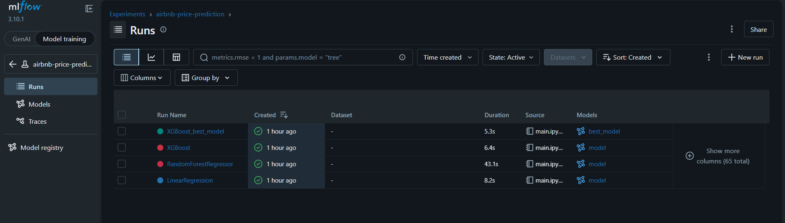
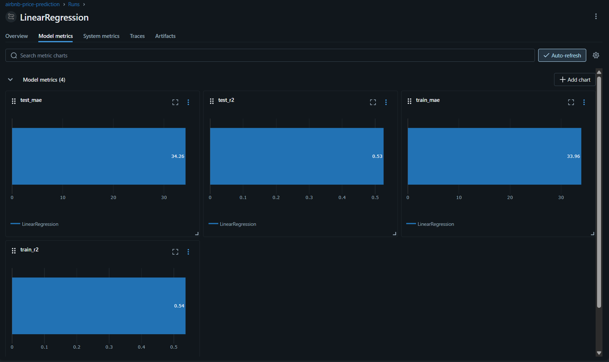
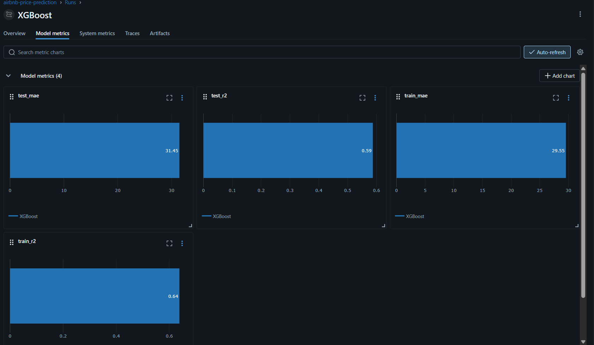
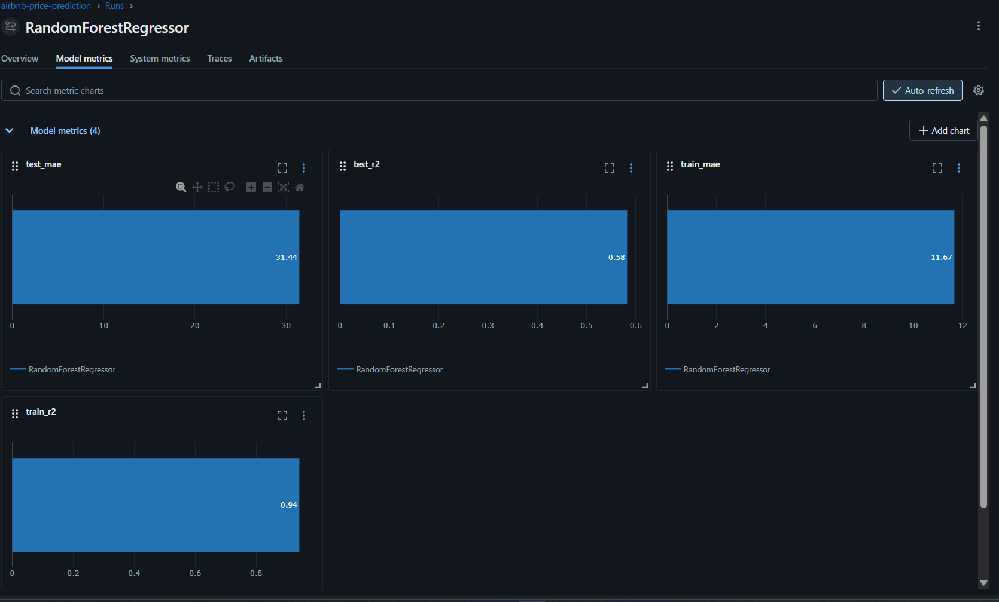
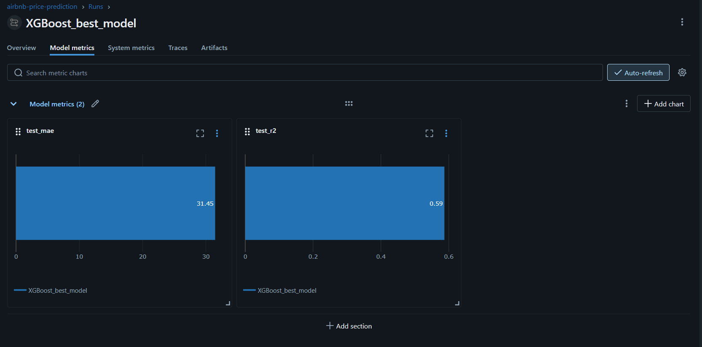

# Airbnb Price Prediction with MLflow

## Project Overview

This project predicts Airbnb listing prices using machine learning regression models.  
The workflow covers data loading, preprocessing, feature engineering, model training, model comparison, and experiment tracking with MLflow.

## Project Objectives

The objectives of this project are:

- Load and prepare Airbnb listing data for modeling.
- Clean missing values and engineer useful features.
- Train multiple regression models for price prediction.
- Evaluate model performance using MAE and R2.
- Track model experiments using MLflow.
- Compare runs to identify the best-performing model.
- Register the top model in the MLflow Model Registry.

## Dataset

The dataset contains Airbnb listing information such as:

- Listing id, name, host_id and host_name
- Neighbourhood and neighbourhood group
- Latitude and longitude
- Room type
- Minimum nights
- Number of reviews
- last_review
- Review history
- calculated_host_listings_count
- Availability
- Price as the target variable

In this notebook, the dataset is loaded from Amazon S3 using `boto3`.

## Preprocessing and Feature Engineering

The following steps were applied in the notebook:

- Checked missing values.
- Converted `last_review` into datetime.
- Extracted:
  - `reviewyear`
  - `reviewmonth`
  - `reviewday`
- Filled missing review-related values with `0`.
- Dropped the original `last_review` column.
- Removed price outliers using the IQR method.
- Applied one-hot encoding to:
  - `neighbourhood`
  - `neighbourhood_group`
  - `room_type`
- Dropped `name` and `host_name` before modeling.
- removed `price` column from the df and used it - as `y` for the target variable.

## Models Trained

The following models were trained and compared:

- Linear Regression
- RandomForestRegressor
- XGBoost Regressor

## Evaluation Metrics

Model performance was evaluated using:

- Mean Absolute Error (MAE)
- R2 Score

## Results

The notebook results show the following model comparison:

| Model | Train MAE | Train R2 | Test MAE | Test R2 |
|---|---:|---:|---:|---:|
| XGBoost| 29.552| 0.638| 31.454 | 0.587 |
| RandomForestRegressor | 11.667| 0.942  | 31.440| 0.582  |
| LinearRegression | 33.957 | 0.536 | 34.257 | 0.526 |

Based on the highest test R2, **XGBoost** was selected as the best model. The notebook then registers the best model in MLflow under the name `AirbnbPricePredictor`.

## MLflow Tracking

MLflow was used to:

- Create an experiment named `airbnb-price-prediction`.
- Log parameters for each model run.
- Log training and testing metrics.
- Save model artifacts.
- Compare model runs.
- Register the best model in the Model Registry.

## Repository Structure

```text
project-folder/
│
├── main.ipynb
├── README.md
├── requirements.txt
├── .gitignore
├── mlruns/                 
├── data/
└── img/                   
```

## Workflow

The workflow used in this project is:

1. Load the dataset from S3.
2. Inspect missing values and data types.
3. Convert and engineer date-related features.
4. Handle missing values.
5. Remove price outliers.
6. Encode categorical features.
7. Drop unnecessary text columns.
8. Split data into training and testing sets.
9. Train Linear Regression, Random Forest, and XGBoost models.
10. Track all model runs in MLflow.
11. Compare run metrics.
12. Register the best model.

## Setup Instructions

### 1. Clone the repository

```bash
git clone <https://github.com/paldentamang040/Airbnb-Price-Predictor.git>
```

### 2. Install dependencies

```bash
pip install -r requirements.txt
```

### 3. Launch Jupyter

```bash
jupyter notebook
```

Then open:

```text
main.ipynb
```

## Running MLflow

To launch the MLflow UI locally, run:

```bash
mlflow ui
```

Then open:

```text
http://127.0.0.1:5000
```

The notebook currently uses a local file-based MLflow tracking URI, which stores runs inside the `mlruns` folder.

## Screenshots

### MLflow Experiment Runs


### MLflow Metrics Comparison





### MLflow Model Registry


## Key Insights and Observations

- Linear Regression provided the weakest baseline performance on the test set.
- Random Forest achieved strong performance, but the large gap between training and testing metrics suggests stronger overfitting than XGBoost.
- XGBoost achieved the best overall test R2 and was chosen as the final model.
- MLflow made it easier to compare models consistently and store the final registered model.
## Notes

- The notebook includes package installation commands for `boto3`, `pandas`, `xgboost`, and `mlflow`.
- A `requirements.txt` file was generated in the notebook using `pip freeze`.
- For security, AWS credentials should not be committed to the repository so the user should use their own credentials.
